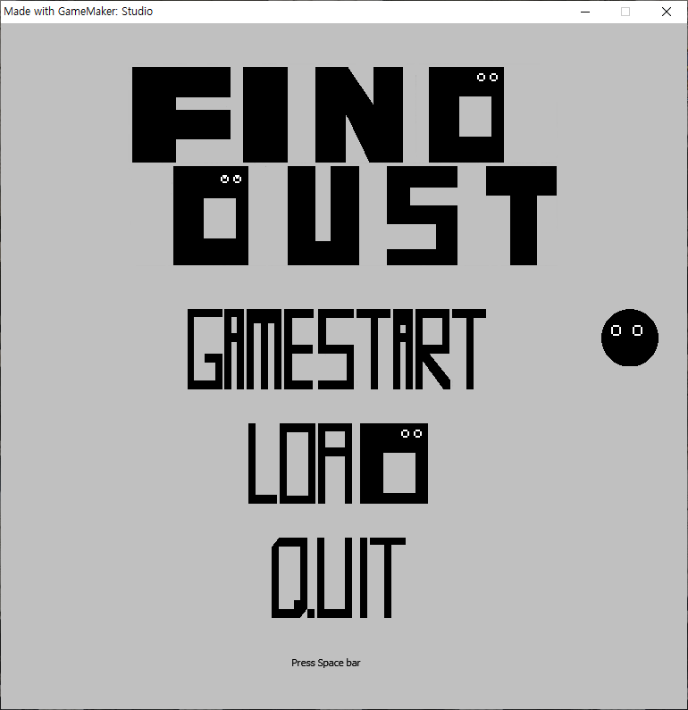

# FIND-DUST

* 서강대학교 MTEC 주최 제 7회 전국 고교생 게임아이디어공모전 우수상
* 개발년도 : 2016년
* Gamemaker Studio 2 를 통해 만든 퍼즐 게임 FIND DUST 입니다.
* 플레이는 EXE 파일을 통해 설치후 플레이 가능합니다.

## 주요 기믹
- 플레이어의 캐릭터(검은색 먼지)는 적(빨간색 먼지)와 닿지 않으면서 포탈(파란색 먼지)로 향해야 한다.
- 모든 캐릭터(먼지)들은 플레이어의 움직임과 동일하게 움직인다.
- 단, 이동하려는 곳에 벽이 있는 경우 그러한 캐릭터는 움직이지 않는다.
- 또한 위의 기믹으로 적(빨간색 먼지) 캐릭터들이 겹쳐질 수 있다.
- 해당 주요 기믹들을 통해 적 캐릭터들의 최대한 겹쳐 숫자를 줄이고, 포탈로 향하는 길을 열어 전진하는 것이 주요 목표이다.
